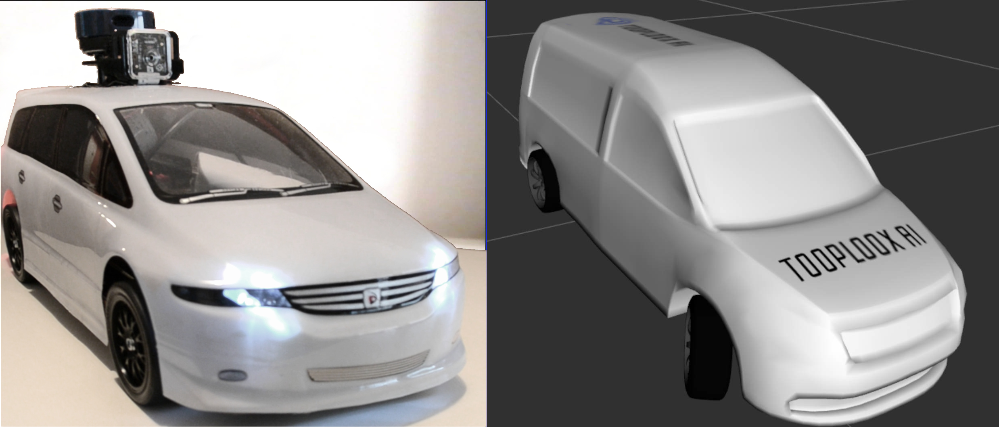
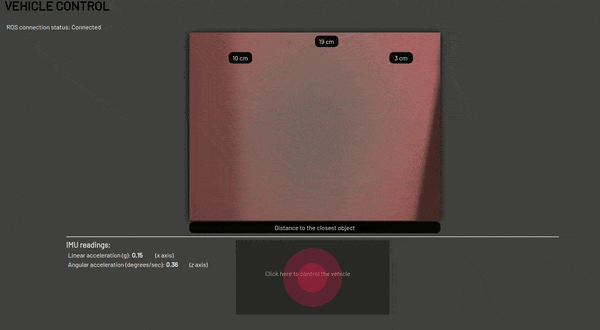
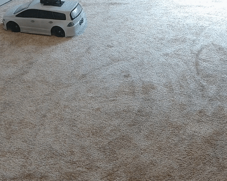

# Autonomous car model [WIP]
  
We're building a model of an autonomous car using ROS framework. The idea is to have a fully functional car in 1:10 scale that we can use for experiments, development and testing of Computer Vision and Machine Learning algorithms.

## Getting started
Please check the documentation: https://autonomous-car-model.readthedocs.io/en/latest

**Attention**
Clone repositories listed in [download.repos](download.repos) before installing dependencies. You can do it manually or by using [vcstool](https://github.com/dirk-thomas/vcstool)

## Current state/functionality
You'll be able to:
1. Manually steer your car using the [nipple.js](https://yoannmoi.net/nipplejs/) joystick
2. Access a camera stream (the settings are hardcoded for raspberry camera, using different camera may require some modifications).
3. Access ultrasonic sensors readings.
4. Access accelerometer and gyroscope readings.
5. Visualize the model in rviz and interact with its joints.

## Using ROS on actual car model
1. (optional) Connect the sensors, motor and servo to pins as specified in the [launch file](catkin_ws/src/car_bringup/launch/start_all.launch) (or modify the file accordingly.) You can run the code on Jetson without any hardware connected to it.
2. From anywhere in the system run:  
`roslaunch car_bringup start_all.launch`
3. You can control the car with the [web GUI](catkin_ws/src/robot_gui_bridge/gui/gui.html). Simply modify the IP address in the sourcecode and open the html file in your browser. Note: of course you can open that file on any machine that can access your Jetson at its IP address.

*Web GUI for manual steering and viewing sensors data*

*Manually controlled robot*

## TODO
We're just learning ROS so in its current state the organisation of the code is not ideal, and some solutions may suboptimal/have a temporary character.  
Please refere to [Issues](https://github.com/tooploox/car_robot/issues) for the details. 

## Plans for the future
1. Install Lidar, run SLAM
2. Add interface for CARLA simulator 
3. Implement path planning
4. Implement image segmentation, drivable area detection
5. Design environment-specific autonomous logic.
6. ...
