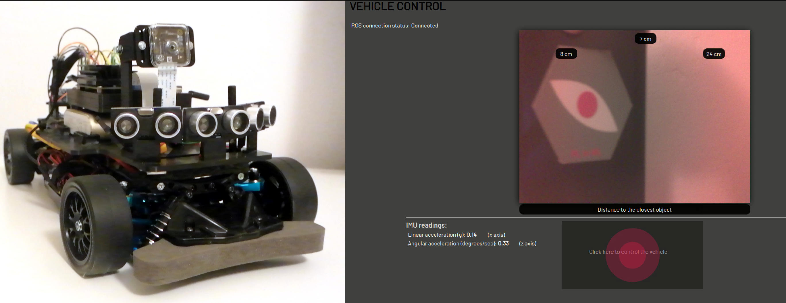
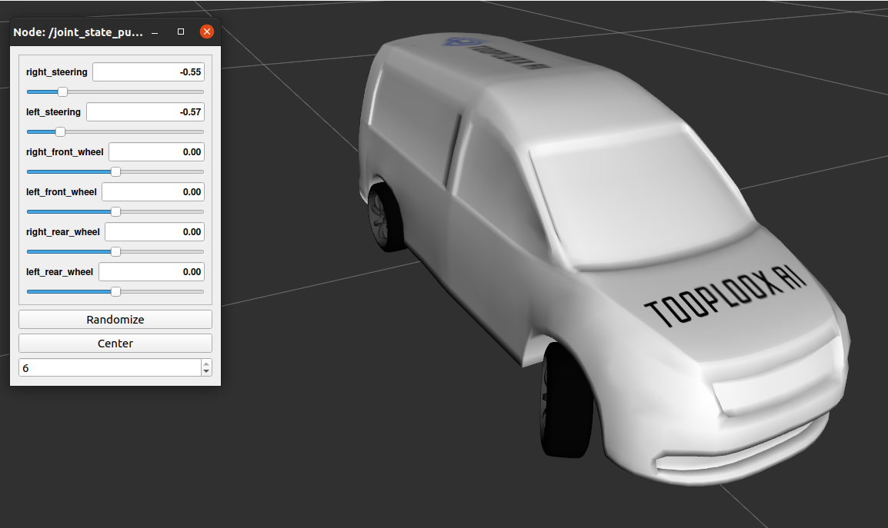

# Autonomous car model [WIP]
  
We're building a model of an autonomous car using ROS framework. The idea is to have a fully functional car in 1:10 scale that we can use for experiments, development and testing of Computer Vision and Machine Learning algorithms.

## Environment
Currently, we're working on ROS Melodic running on **Jetson Nano**. The distribution doesn't support Python 3, so we'll probably switch to Noetic at some point. There are no plans on using ROS 2 at the moment.

Packages and nodes within them can be developed independently. **Individual nodes can be implemented in Python or C++**.

### Preparing the environment
Naturally, to interact with the actual hardware you'd need the access to it. In such case ROS must be installed on the robot.  

If you don't have the access to the real hardware you can work in the simulated environment. You'll still need ROS installed on your computer though. Please note that the Python code should work with both, version 2 and 3 (full transition to Python 3 is planned). 

1. Install ROS as described here: http://wiki.ros.org/melodic/Installation/Ubuntu
2. Activate the workspace by running `devel/setup.bash` script. For convenience, it's recommended to add a similar command to bashrc script.  
   `source <ABSOLUTE PATH REQUIRED>/catkin_ws/devel/setup.bash`
3. Build the project:
Navigate to the [catkin_ws](catkin_ws) directory and run `catkin_make`
   
## Simulation
As using the actual robot is to always possible or convenient we recreated it in the simulated environment. This way it should be easier to develop and test solutions that can be then executed on the real car model as well.

### Model description
You can visualize the robot model in rozviz (tested in ROS Noetic) and interact with the model's joints using a simple GUI.
To do so run:  
`roslaunch robot_description urdf_visualize.launch`

You should see a visualization like this:

Dimensions of the wheels and spacing between them match the actual robot.
The cubature of the body is roughly the same as in the reality. 

Sensors are not included yet.

### Gazebo simulation
Not implemented yet
   
## Using ROS on actual car model
1. (optional) Connect the sensors, motor and servo to pins as specified in the [launch file](catkin_ws/src/car_bringup/launch/start_all.launch) (or modify the file accordingly.) You can run the code on Jetson without any hardware connected to it.
2. From anywhere in the system run:  
`roslaunch car_bringup start_all.launch`
3. You can control the car with the [web GUI](catkin_ws/src/robot_gui_bridge/gui/gui.html). Simply modify the IP address in the sourcecode and open the html file in your browser. Note: of course you can open that file on any machine that can access your Jetson at its IP address.

## Current state/functionality
You'll be able to:
1. Manually steer your car using the [nipple.js](https://yoannmoi.net/nipplejs/) joystick
2. Access a camera stream (the settings are hardcoded for raspberry camera, using different camera may require some modifications).
3. Access ultrasonic sensors readings.
4. Access accelerometer and gyroscope readings.
5. Visualize the model in rozviz and interact with its joints.

## TODO lists
We're just learning ROS so in its current state the organisation of the code is not ideal, and some solutions may suboptimal/have a temporary character.  

### Robot side
- [ ] Replace a motor, test VESC, try to achieve a good low speed control.
- [ ] Mock GPIO imports, so the code can be executed on a PC.
- [ ] Refactor the communication with ultrasonic sensors, so they use interruptions instead of the `while loops`.
- [ ] Add support for additional sensors - magnetometer, motor encoder, possibly motor temperature sensor (analog <> digital converter required), GPS.
- [ ] Visualize the car's pitch, roll, yaw and heading in real time using OpenGL.

### Simulation side
- [ ] Add robot description and support Gazebo simulation
   - [x] Create basic working URDF description
   - [x] Add custom 3D meshes
   - [x] Create a basic Gazebo world
   - [x] Make it possible to spawn the basic, not functional model in Gazebo.
   - [ ] **Change the URDF definition, so the model reflects the real robot better, namely there is a single joint for steering. This is a reasonable example: https://github.com/srmainwaring/steer_bot**
   - [ ] Add actuators
   - [ ] Make the URDF file cleaner by using XACRO / refactor, change objects names
   - [ ] Crate a model's controller
   - [ ] Check the accuracy of physical parameters used for simulation
   - [ ] Support sensors

### General
- [ ] Reorganise the packages, so the structure makes more sense
- [ ] Correct the utilization of Twist messages. This is a big topic. My idea for now is to use ackermann steering controller like here: https://github.com/srmainwaring/steer_bot. But maybe we should have another controller to control the robot like in CARLA simulator. 
- [ ] Implement a basic autonomous logic (ex. brake when any of the ultrasonic sensors shows a small distance).
- [ ] Add tests
  - [ ] Node level tests
  - [ ] ROS level tests
  - [ ] Integration tests

## Plans for the future
1. Install Lidar, run SLAM
2. Add interface for CARLA simulator 
3. Implement path planning
4. Implement image segmentation, drivable area detection
5. Design environment-specific autonomous logic.
6. ...

## Resources

### Our posts on Medium:
`To be linked`

1. Collecting hardware ([draft](https://medium.com/@adam.slucki/building-an-autonomous-car-76d8b9dfb86b))
2. Controlling the steering servo and motor, Jetson Nano GPIO setup ([draft](https://medium.com/@adam.slucki/building-an-autonomous-car-3321b2be101e))
3. Sensors - what they do and how to access them on Jetson.
4. Simulated environment
   
### Learning ROS:
1. Good udemy course to get started: https://www.udemy.com/course/ros-for-beginners/
2. ROS in 5 days playlist on YT: https://www.youtube.com/watch?v=wOlfT8GUcCk&list=PLTMwfiy4PNc38yWkoT0QXCm8L34m0OxTA
3. Building a simulated model for Gazebo, YT videos, blogposts and github repo: https://www.youtube.com/watch?v=8ckSl4MbZLg,  
   http://moorerobots.com/blog/post/1,
   https://github.com/richardw05/mybot_ws.git
4. Courses on: https://www.theconstructsim.com/ This is a paid platform. Courses are delivered in a form of notebooks to execute in the interactive shell. Recorded videos could be better, but still it's the best place when it comes to the coverage of topics and good practices.
5. Production package for controlling cars, bitbucket repo: https://bitbucket.org/DataspeedInc/dbw_mkz_ros/src/master/
6. Ackermann steering robot: http://wiki.ros.org/Robots/CIR-KIT-Unit03