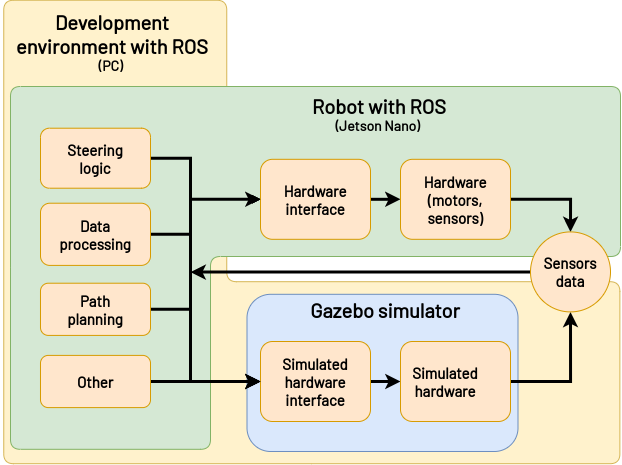
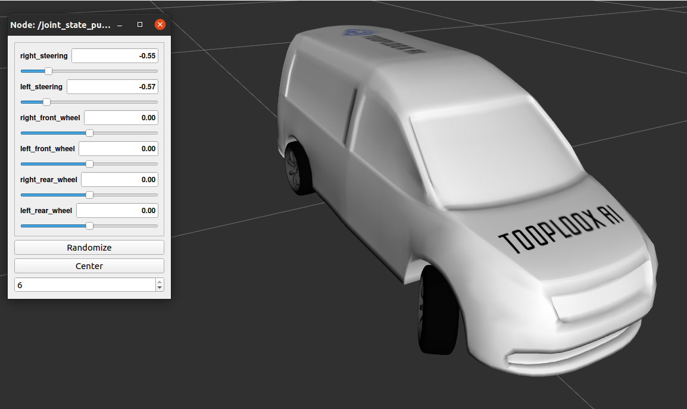

***************
Getting started
***************
The fact that we're running the first iteration on this project and that the ROS itself has some learning curve it can be difficult to start. We hope that this guide will help!

**Why ROS**

We are aware that it could be easier without ROS, but:

1. ROS can be used in commercial projects so it's worth learning.
2. There many tools available that can be used within ROS projects (mapping, path planning, etc).
3. There is a supportive community and learning material - something we couldn't provide if the project wasn't based on ROS.
4. ROS promotes the architecture where all the modules are loosely coupled. It means that at some point we should be able to develop new models almost completely independently from the code in this project.

High level overview
===================

We're working on multiple platforms so the setup may be a little bit confusing. There is a robot running the whole system and a separate platform for development and testing where only the hardware part of the robot is replaced with a simulator.

You'd need to prepare the environment on the robot and your computer separately. Separation between the simulation and actual robot should be done at the lowest possible level.

Environment preparation
=======================
It consists of multiple steps:
1. (optional) Prepare docker or virtual machine.
2. Install and setup ROS.
3. Clone the repository and install the dependencies.

For now we're working in ROS 1, but once everything is working we might switch to ROS 2.

Install ROS and dependency manager
----------------------------------
Depending the operating system you're using the steps may be different. The goal is to have working ROS Noetic on both the Jetson and your computer. Notice that within the same distribution there are multiple versions of ROS. You should install the minimal version on the Jetson and the full version on your desktop.

**Ubuntu Focal / Debian Buster:**
You can install prebuilt ROS following these instructions:
http://wiki.ros.org/noetic/Installation

**Jetson / Ubuntu (other than Focal) / Debian (other than Buster):**
To install ROS Noetic on Jetson which is running Ubuntu 18, you'll have to build it from source first. Follow these instructions: http://wiki.ros.org/noetic/Installation/Source

**Mac OSX/Windows:**
Unfortunately those systems are poorly or not supported. You'll need a virtual machine with Ubuntu or Debian. On Mac OSX you can also work in docker but we don't find it very comfortable, especially with GUI programmes like Gazebo or rviz. But still this is an option. The best solution we've tested was this: https://github.com/nebocleaning/mac-ros/tree/e0e2c71089a5eb56b08d39d6cc41737d56e58e27

.. note::
    When using the docker based solution presented above you'll have to specify environmental variables in two env files (see the linked repo). It might not be obvious how to find ROS master URI. To find out you can initially ignore that variable and:

        1. Run: docker-compose up --build
        2. In a separate terminal run: docker-compose exec ros bash
        3. In the terminal from step 2. run: roscore
        4. Once the master node starts it will display its URI adress.

Setup catkin workspace
------------------------------
To use catkin with is the building tool for ROS you'll have to create a workspaces and let catkin know where it's located. You can have multiple workspaces but only one can be active at the time.

You can run the code presented below to create and activate catkin workspace (http://wiki.ros.org/catkin/Tutorials/create_a_workspace)

.. code-block:: bash

   $ mkdir -p ~/catkin_ws/src
   $ cd ~/catkin_ws/
   $ catkin_make
   $ source devel/setup.bash

Your workspace will be active only in the current terminal until you close it. To activate the workspace automatically in new terminal windows you should add the above command to your bashrc:

.. code-block:: bash

   $ echo 'source <path to catkin workspace>/devel/setup.bash' >> ~/.bashrc

Clone the repository, install dependencies and build the project
----------------------------------------------------------------
The repository should be cloned to the src directory in your catkin workspace. You can run the following commands to clone the repository and install dependencies.

.. code-block:: bash

    $ cd <path to catkin workspace>/src
    $ git clone https://github.com/tooploox/autonomous_car_model.git
    $ cd ..
    $ rosdep install --from-paths src --ignore-src -r -y
    $ catkin_make

Visualize the car's model in rviz
---------------------------------
You can load 3D model of our car into rviz and interact with it's joints using a simple GUI. Execute the command below to start the GUI.

.. code-block:: bash

   $ roslaunch robot_description urdf_visualize.launch

You should see the rviz windows as presented below:

