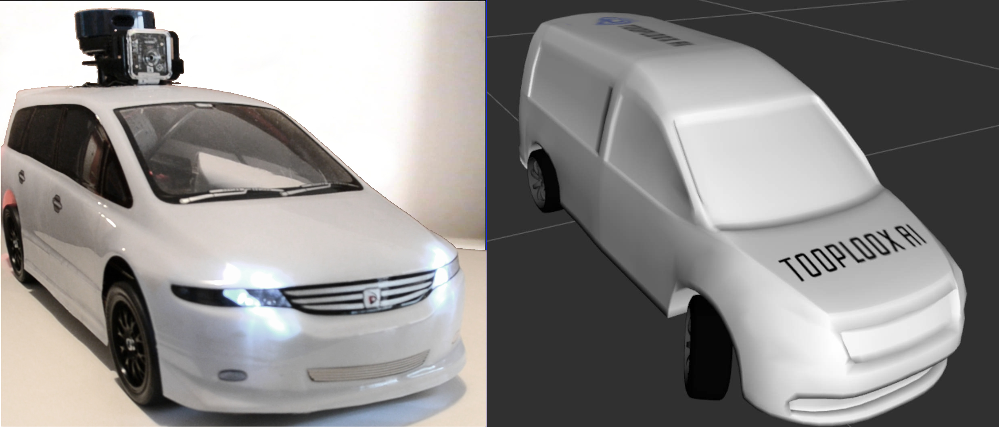

.. autonomous car model documentation master file, created by
   sphinx-quickstart on Fri Apr 16 16:40:11 2021.
   You can adapt this file completely to your liking, but it should at least
   contain the root `toctree` directive.

***********************************
Autonomous car model and simulation
***********************************

We're building a model of an autonomous car using ROS framework. The idea is to have a fully functional car in 1:10 scale that we can use for experiments, development and testing of Computer Vision and Machine Learning algorithms.

Contents
========

.. toctree::
   :maxdepth: 2

   getting_started
   resources
